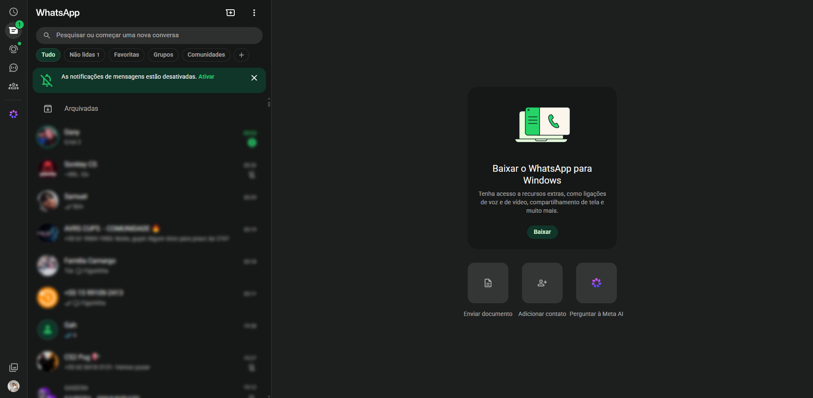
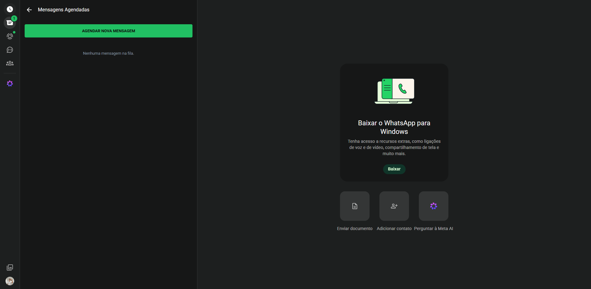
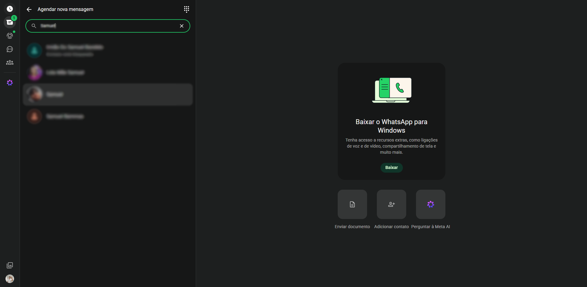
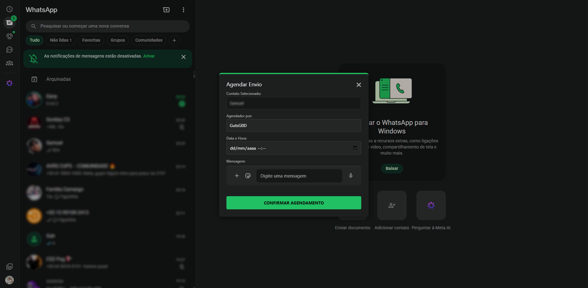
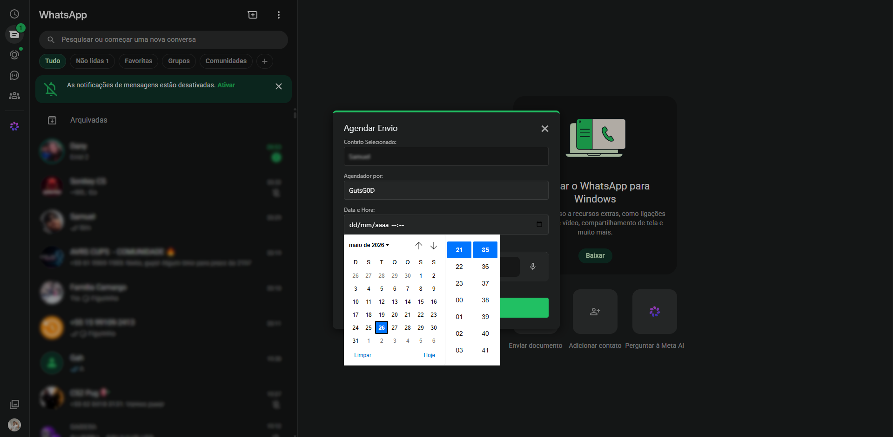
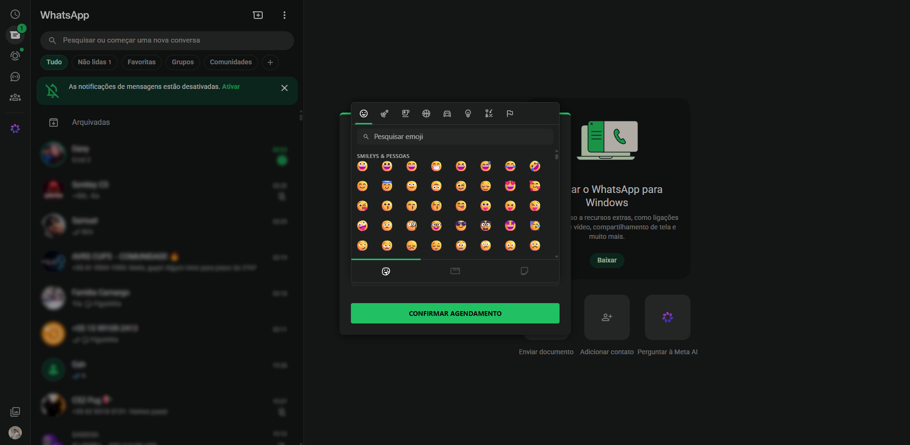
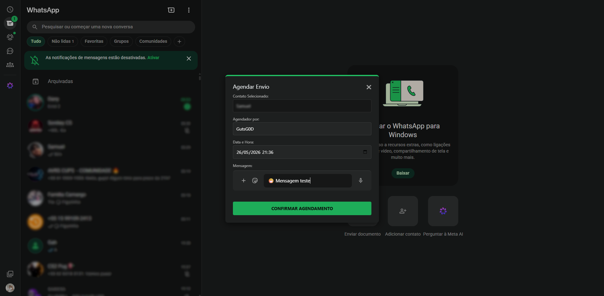
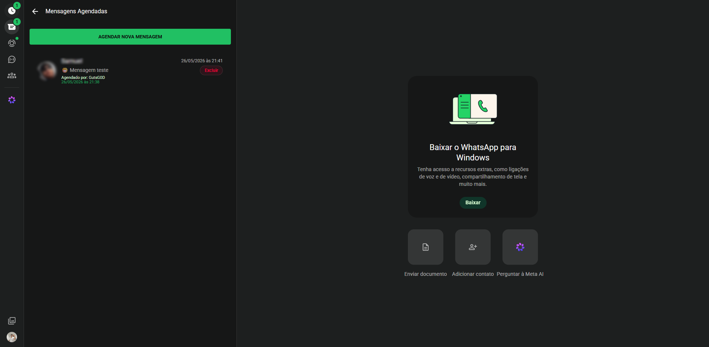
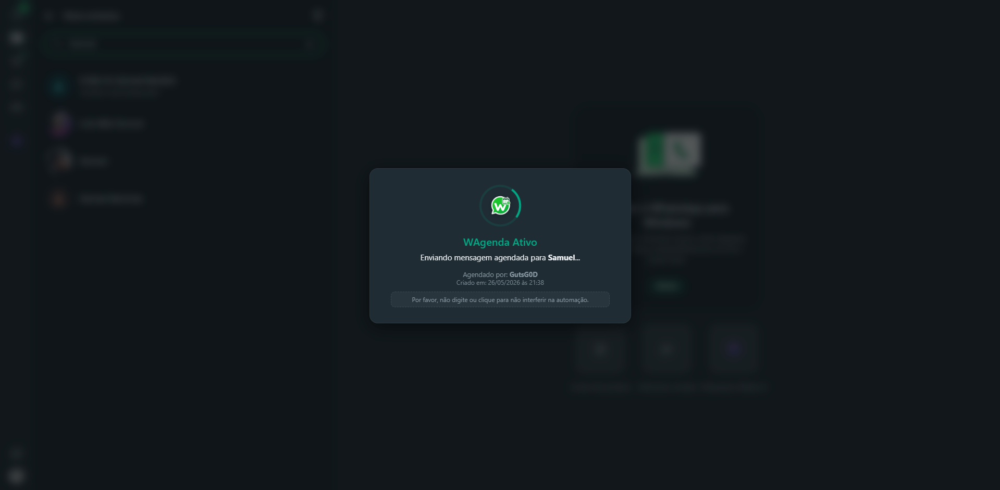
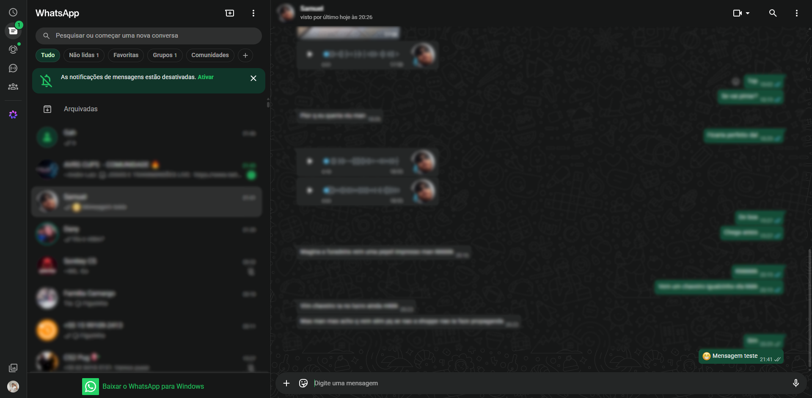

[](https://github.com/GutsG0D/WAgenda)

# WAgenda

[](https://deepwiki.com/GutsG0D/WAgenda)
[](http://www.gnu.org/licenses/agpl-3.0)


[](https://github.com/GutsG0D/WAgenda)

WAgenda is a Chrome extension that allows you to schedule messages on WhatsApp Web. It seamlessly integrates into the WhatsApp interface, providing a user-friendly way to automate your messaging.

---

_O WAgenda é uma extensão para o Chrome que permite agendar mensagens no WhatsApp Web. Ele se integra perfeitamente à interface do WhatsApp, proporcionando uma forma intuitiva de automatizar o envio de suas mensagens._

## Features 🇺🇸

- **Integrated UI**: Adds a clock icon to the WhatsApp Web header to access all scheduling features without leaving the page.
- **In-Page Multi-Contact Scheduling**: Schedule a single message to multiple recipients at once by selecting multiple contacts directly from your list.
- **Visual Contact Picker inside Modal**: A beautiful contact display inside the modal showing profile pictures, names, and quick-remove `✖` buttons.
- **"+ Add Contact" Flow**: Seamless transition to select additional recipients from the WhatsApp Web drawer without losing your typed message or date.
- **Message Management**: View, manage, and cancel all your pending scheduled messages in a dedicated panel.
- **Rich Text Input**: An advanced message composition box with a built-in emoji picker, complete with search and recent emojis functionality.
- **Scheduler Identification**: Add your name as the "scheduler" for each message, providing context for shared accounts.
- **Automated Sending**: A "robot" mode takes over to send the message at the scheduled time, displaying an overlay to prevent user interference.
- **Sent History Navigation**: View the history of sent messages in an elegant, well-spaced list. Click on any past message to automatically search for it in the WhatsApp Web search input and open the corresponding conversation directly!
- **Label Tagging & Colors**: Add custom colored labels to your scheduled messages using a native-feeling color selector and keyboard composition interface.
- **Dynamic Scheduling Filter**: A premium filter button in the header allows you to filter pending scheduled messages and past history dynamically by label.
- **Native Label Manager Popover**: A dedicated management entry button next to the filter button opens a clean floating menu. Perform inline editing of label names and colors with dynamically reactive circular previews, "Etiqueta" descriptors, and premium checkmark/cancel SVGs that trigger immediate cascade updates on all storage data.
- **Pending Count Badge**: A badge on the WAgenda icon shows the number of currently scheduled messages.

---

### Funcionalidades 🇧🇷

- **Interface Integrada**: Adiciona um ícone de relógio ao cabeçalho do WhatsApp Web para acessar todos os recursos de agendamento sem sair da página.
- **Agendamento Multi-Contato**: Agende uma única mensagem para vários contatos de uma só vez selecionando múltiplos destinatários da sua lista.
- **Seletor Visual de Contatos no Modal**: Exibição premium no modal mostrando as fotos de perfil, nomes e botões `✖` para remoção rápida de destinatários.
- **Fluxo "+ Adicionar Contato"**: Transição inteligente para selecionar novos destinatários a partir da gaveta nativa do WhatsApp sem perder o texto ou a data que você já digitou.
- **Gerenciamento de Mensagens**: Visualize, gerencie e cancele todas as suas mensagens agendadas pendentes em um painel dedicado.
- **Entrada de Texto Rico**: Uma caixa avançada de composição de mensagens com um seletor de emojis integrado, contendo busca e emojis recentes.
- **Identificação do Agendador**: Adicione seu nome como o "agendador" de cada mensagem, fornecendo contexto para contas compartilhadas.
- **Envio Automatizado**: Um modo "robô" assume o controle para enviar a mensagem no horário agendado, exibindo uma tela de bloqueio para evitar a interferência do usuário.
- **Navegação do Histórico de Envios**: Visualize o histórico de mensagens enviadas em uma lista espaçada e elegante. Clique em qualquer card do histórico para que a extensão busque a mensagem na busca nativa do WhatsApp e abra a conversa do destinatário correspondente na hora!
- **Sistema de Etiquetas Coloridas**: Associe etiquetas personalizadas aos agendamentos para categorizar e gerenciar seus envios de forma muito mais simples.
- **Filtro Dinâmico de Envios**: Filtre na hora os cards de agendamentos pendentes ou históricos utilizando um elegante botão de filtro unificado no cabeçalho do painel.
- **Gerenciador de Etiquetas Nativo**: Um popover dedicado que permite gerenciar todas as suas etiquetas. Edite o nome e a cor da etiqueta de forma inline com um editor reativo idêntico ao do WhatsApp (círculo com preview de cor dinâmico, rótulo "Etiqueta" cinza e botões premium em SVG), atualizando em cascata todo o seu histórico e agendamentos.
- **Selo de Contagem de Pendentes**: Um selo (badge) no ícone do WAgenda mostra a quantidade de mensagens agendadas atualmente.

## How It Works 🇺🇸

The extension operates through a combination of a content script and a background service worker:

1.  **UI Injection**: The `content.js` script injects a new clock button into the WhatsApp Web header.
2.  **Scheduling**:
    - Clicking the clock icon opens a custom panel within the "New Chat" drawer, listing all scheduled messages.
    - When you choose to schedule a new message, you select a contact, and a modal appears.
    - You fill in the details (date, time, message, and your name as the scheduler).
3.  **Alarm Creation**: The message details are sent to `background.js`, which saves the data to `chrome.storage.local` and sets a precise `chrome.alarms` event.
4.  **Execution**:
    - When the alarm triggers, the background script notifies the content script to start the sending process.
    - The `content.js` script displays a "WAgenda Ativo" overlay to block user input and prevent errors.
    - It then automates the steps: searching for the contact, entering the message text into the chat box, and clicking the send button.
5.  **Cleanup**: Once the message is sent, the overlay is removed, the message is cleared from the pending list, and the badge count is updated.

---

### Como Funciona 🇧🇷

A extensão funciona através da combinação de um script de conteúdo (content script) e um service worker em segundo plano (background):

1.  **Injeção de UI**: O script `content.js` injeta um novo botão de relógio no cabeçalho do WhatsApp Web.
2.  **Agendamento**:
    - Clicar no ícone de relógio abre um painel personalizado dentro do menu "Nova Conversa", listando todas as mensagens agendadas.
    - Ao optar por agendar uma nova mensagem, você escolhe um contato e um modal é exibido.
    - Você preenche os detalhes (data, hora, mensagem e seu nome como agendador).
3.  **Criação do Alarme**: Os detalhes da mensagem são enviados para o `background.js`, que salva os dados no `chrome.storage.local` e define um evento preciso no `chrome.alarms`.
4.  **Execução**:
    - Quando o alarme dispara, o script de background notifica o script de conteúdo para iniciar o processo de envio.
    - O script `content.js` exibe uma sobreposição escrita "WAgenda Ativo" para bloquear a entrada de dados do usuário e evitar erros.
    - Ele então automatiza as etapas: pesquisa o contato, insere o texto da mensagem na caixa de conversa e clica no botão de enviar.
5.  **Limpeza**: Assim que a mensagem é enviada, a tela de sobreposição é removida, a mensagem é limpa da lista de pendentes e o contador do selo (badge) é atualizado.

## Installation 🇺🇸

Since this extension is not on the Chrome Web Store, you need to install it manually.

1.  Download or clone this repository to your local machine.
    ```shell
    git clone https://github.com/GutsG0D/WAgenda.git
    ```
2.  Open Google Chrome and navigate to the extensions page: `chrome://extensions`.
3.  Enable **Developer mode** using the toggle in the top-right corner.
4.  Click the **Load unpacked** button.
5.  Select the directory where you cloned or downloaded the repository.
6.  The WAgenda extension will now be active in your browser.

---

### Instalação 🇧🇷

Como esta extensão não está na Chrome Web Store, você precisa instalá-la manualmente.

1.  Baixe ou clone este repositório para sua máquina local.
    ```shell
    git clone https://github.com/GutsG0D/WAgenda.git
    ```
2.  Abra o Google Chrome e navegue até a página de extensões: `chrome://extensions`.
3.  Ative o **Modo do desenvolvedor** usando a chave seletora no canto superior direito.
4.  Clique no botão **Carregar sem compactação** (Load unpacked).
5.  Selecione o diretório onde você clonou ou baixou o repositório.
6.  A extensão WAgenda agora estará ativa no seu navegador.

## Usage 🇺🇸

1.  Open or refresh WhatsApp Web (`web.whatsapp.com`).
2.  You will see a new **clock icon** in the header, above the "Chats" button.
3.  Click the clock icon to open the scheduling panel. It will display your list of scheduled messages.
4.  Click **Agendar Nova Mensagem** (Schedule New Message). The panel will switch to your contact list.
5.  Click on the contact you want to schedule a message for.
6.  An "Agendar Envio" (Schedule Sending) modal will appear.
    - The contact's name is pre-filled.
    - Enter your name in the **Agendador por** (Scheduled by) field.
    - Select the desired date and time.
    - Type your message in the text area. You can use the emoji button to open a full-featured emoji picker.
7.  Click **Confirmar Agendamento** (Confirm Schedule).
8.  The extension will handle the rest! You can see your new message in the list. To cancel, simply click the **Excluir** (Delete) button on the message card.

---

### Como Usar 🇧🇷

1.  Abra ou atualize o WhatsApp Web (`web.whatsapp.com`).
2.  Você verá um novo **ícone de relógio** no cabeçalho, acima do botão "Conversas".
3.  Clique no ícone de relógio para abrir o painel de agendamento. Ele exibirá sua lista de mensagens agendadas.
4.  Clique em **Agendar Nova Mensagem**. O painel mudará para a sua lista de contatos.
5.  Clique no contato para o qual deseja agendar uma mensagem.
6.  Um modal "Agendar Envio" será exibido.
    - O nome do contato é pré-preenchido.
    - Insira seu nome no campo **Agendador por**.
    - Selecione a data e a hora desejadas.
    - Digite sua mensagem na área de texto. Você pode usar o botão de emoji para abrir um seletor de emojis completo.
7.  Clique em **Confirmar Agendamento**.
8.  A extensão cuidará do resto! Você poderá ver sua nova mensagem na lista. Para cancelar, basta clicar no botão **Excluir** no card da mensagem.

## Authors

- [@GutsG0D](https://www.github.com/GutsG0D)

## Screenshots











